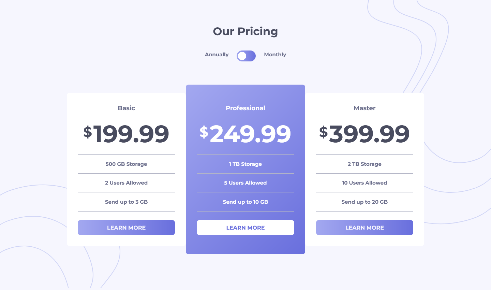

# Frontend Mentor - Pricing component with toggle solution

This is a solution to the [Pricing component with toggle challenge on Frontend Mentor](https://www.frontendmentor.io/challenges/pricing-component-with-toggle-8vPwRMIC). Frontend Mentor challenges help you improve your coding skills by building realistic projects.

## Table of contents

-   [Overview](#overview)
    -   [The challenge](#the-challenge)
    -   [Screenshot](#screenshot)
    -   [Links](#links)
-   [My process](#my-process)
    -   [Built with](#built-with)
    -   [What I learned](#what-i-learned)
    -   [Continued development](#continued-development)
-   [Author](#author)

## Overview

### The challenge

Users should be able to:

-   View the optimal layout for the component depending on their device's screen size
-   Control the toggle with both their mouse/trackpad and their keyboard
-   **Bonus**: Complete the challenge with just HTML and CSS

### Screenshot

### Links

-   Solution URL: [Add solution URL here](https://github.com/c0dehamster/pricing-component-with-toggle)
-   Live Site URL: [Add live site URL here](https://c0dehamster.github.io/pricing-component-with-toggle/)

## My process

### Built with

-   Semantic HTML5 markup
-   CSS custom properties
-   Flexbox
-   CSS Grid
-   Mobile-first workflow
-   BEM naming convention

### What I learned

This was a fairly simple project to complete. One part of it that required some research was the toggle switch in the header of the page. I had not used even simple animations before so I had to look up information about them.

This project was also a goob practice for using pseudo-elements.

### Continued development

I did not try to complete my solution without JS. I can see how it can be done and might return to the challenge later.

## Author

-   Frontend Mentor - [@twDevNoob](https://www.frontendmentor.io/profile/twDevNoob)
